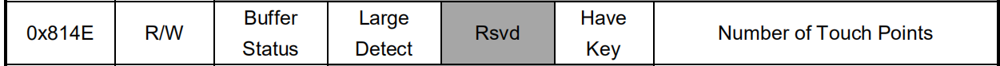

# 多点触摸

多点触摸的缓冲区：

```C
u8 touch_data[1 + 8 * 10 + 2] = { 0 };
```

从 `0x814E` 状态寄存器开始读取数据，第一个字节是状态寄存器，



之后是触摸点数据，每一个触摸点数据占 8 个字节，最多有 10 个触摸点数据。


第 10 个触摸点数据之后还有一个字节的 `KeyValue` 和 `CheckSum` 。


一共需要 `1 + 8 * GTP_MAX_TOUCH + 2` 个字节的缓冲区。

轮询时读取 `0x814E` 处寄存器，若 `Buffer Status` 位为 1 且 `Number of Touch Points` 字段数据大于 0 ，则读取相应数量的触摸点数。

根据实际情况，代码里预读取了一个触摸点数据的缓存大小（最常用情况），若触摸点大于一个，再读取相应数据。